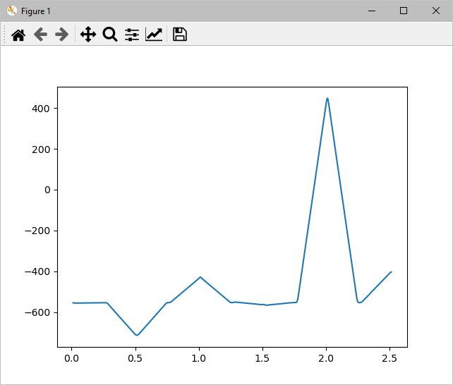

# Synchronize multiple audio tracks using a "marker" signal <!-- omit in toc --> 

- [When to use](#when-to-use)
- [How to use](#how-to-use)
- [Usages](#usages)
  - [gen_marker.py](#gen_markerpy)
  - [detect_marker.py](#detect_markerpy)
  - [gen_synced_eaf.py](#gen_synced_eafpy)
  - [DetectMarker.py](#detectmarkerpy)

## When to use
You are recording some session (interview or something) using multiple recording devices such as an audio recorder and a video camera. Later, you want to synchronize both recodings. 

Traditional way to do this is to use a clapperboard, and manually synchronize recorded tracks by looking at the waveforms. Or to use some professional recording equipment that can record some synchronization signal or timecodes. The purpose of these scripts is for a poor-man's method that allows you to automatically synchronize recordings using cheap devices.

## How to use
1. Genearate a 'marker' wave sound file by `gen_marker.py`
1. After you start recording, playback the marker file (I do this with my smartphone)
1. Start your session to be recorded
1. After recording, parse the audio tracks with `detect_marker.py`  
   or  
   Generate syncrhonized ELAN file (eaf) with `gen_synced_eaf.py`

If one (or more) of the recordings to be synchronized is a video clip, use [ffmpeg](https://ffmpeg.org/) or something similar to extract audio track(s) in wave format as following:
```sh
# simple conversion
> ffmpeg -i in.mp4 out.wav

# reduce message output
> ffmpeg -hide_banner -loglevel error -i in.mp4 out.wav

# single channel, extract 60 seconds after skipping first 30 seconds
> ffmpeg -i in.mp4 -ac 1 -acodec pcm_s16le -f wav -ss 30 -t 60 out.wav

# only right channel (ch2), sampling frequency 16kHz. replace 'FR' as 'FL' if you need ch1.
> ffmpeg -i in.mp4 -ac 1 -ar 16000 -acodec pcm_s16le -af "pan=mono|FC=FR" -f wav out.wav
```
For `gen_synced_eaf.py`, you may want to name the extracted audio file as `XXX_mp4.wav` (see below).

## Usages

### gen_marker.py

Generate syncrhonization signal as a wave file, using specified DTMF sound sequence.
```
> python gen_marker.py -h
usage: gen_marker.py [-h] [-freq FREQ] [-dur DUR] [-pat PAT]

generate marker wave file

optional arguments:
  -h, --help  show this help message and exit
  -freq FREQ  sampling frequency (default: 44100)
  -dur DUR    duration of single tone in seconds (default: 0.25)
  -seq SEQ    DTMF sound sequence to use as marker (default: 1738)
```
By running the script without arguments, 'marker_1738.wav' is generated.

### detect_marker.py

Detect marker sound position in audio recording.  
***Note***: if input wave file has multiple channels, only ch2 will be used to detect the marker pattern.
```
> python detect_marker.py -h
usage: detect_marker.py [-h] marker infiles [infiles ...]

detect marker wave pattern

positional arguments:
  marker
  infiles

optional arguments:
  -h, --help  show this help message and exit
```

Example:
```
> python gen_marker.py (-> marker_1738.wav)
> python gen_marker.py -seq 001738000 (-> marker_001738000.wav)
> python gen_marker.py -seq 000173800 (-> marker_000173800.wav)
> python gen_marker.py -seq 000017380 (-> marker_000017380.wav)

> python detect_marker.py marker_1738.wav marker_001738000.wav \
marker_000173800.wav marker_000017380.wav

--> output
marker_001738000.wav: marker found at: 1.013 sec
marker_000173800.wav: marker found at: 1.512 sec
  diff: 0.499 sec
marker_000017380.wav: marker found at: 2.011 sec
  diff: 0.998 sec
```

### gen_synced_eaf.py

Generate syncrhonized ELAN file (eaf) that referes to multiple media files.  
***Note***: if input file ends with '_mp4.wav', MEDIA_URL is made as '.mp4'  
Requires: [pympi](https://github.com/dopefishh/pympi).
```
> python gen_synced_eaf.py -h
usage: gen_synced_eaf.py [-h] [-marker MARKER] [-dur DUR] [-out OUT]
                         infiles [infiles ...]

generate synchronized ELAN file

positional arguments:
  infiles         audio files to synchronize

optional arguments:
  -h, --help      show this help message and exit
  -marker MARKER  marker filename (default: marker.wav)
  -dur DUR        duration to check marker pattern (seconds). Specify 0 to
                  check the whole file (default: 300)
  -out OUT        resulting eaf filename. Specify "-" for stdout (default: -)
```

Example:
```xml
> mv marker_001738000.wav marker_001738000_mp4.wav
> python gen_synced_eaf.py marker_001738000_mp4.wav \
    marker_000173800.wav marker_000017380.wav

<ANNOTATION_DOCUMENT AUTHOR="pympi" DATE="2022-09-27T22:13:26+09:00" VERSION="2.8" FORMAT="2.8" xmlns:xsi="http://www.w3.org/2001/XMLSchema-instance" xsi:noNamespaceSchemaLocation="http://www.mpi.nl/tools/elan/EAFv2.8.xsd">
        <HEADER>
                <MEDIA_DESCRIPTOR MEDIA_URL="marker_000017380.wav" MIME_TYPE="audio/wav" TIME_ORIGIN="998" />
                <MEDIA_DESCRIPTOR MEDIA_URL="marker_000173800.wav" MIME_TYPE="audio/wav" TIME_ORIGIN="499" />
                <MEDIA_DESCRIPTOR MEDIA_URL="./marker_001738000.mp4" MIME_TYPE="video/mp4" />
                <PROPERTY NAME="lastUsedAnnotation">0</PROPERTY>
                </HEADER>
        <TIME_ORDER />
        <TIER TIER_ID="default" LINGUISTIC_TYPE_REF="default-lt" />
        <LINGUISTIC_TYPE LINGUISTIC_TYPE_ID="default-lt" TIME_ALIGNABLE="true" GRAPHIC_REFERENCES="false" />
        <CONSTRAINT STEREOTYPE="Time_Subdivision" DESCRIPTION="Time subdivision of parent annotation's time interval, no time gaps allowed within this interval" />
        <CONSTRAINT STEREOTYPE="Symbolic_Subdivision" DESCRIPTION="Symbolic subdivision of a parent annotation. Annotations refering to the same parent are ordered" />
        <CONSTRAINT STEREOTYPE="Symbolic_Association" DESCRIPTION="1-1 association with a parent annotation" />
        <CONSTRAINT STEREOTYPE="Included_In" DESCRIPTION="Time alignable annotations within the parent annotation's time interval, gaps are allowed" />
        </ANNOTATION_DOCUMENT>
```

### DetectMarker.py

Python module for detecting marker pattern. Can also be used to plot result likelihood.

```
> python DetectMarker.py marker_1738.wav marker_000017380.wav
```

